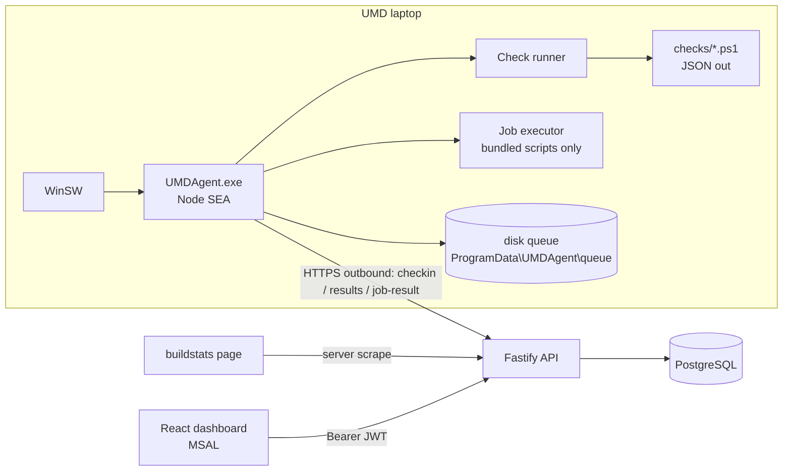

# UMD Post-Imaging Validation — Build Plan

> **Audience:** an implementation agent (or a developer) working one task at a time.
> **Status:** design approved in principle. Values marked `TBD(P0-x)` come from the
> Phase 0 laptop walkthrough (§10). Do not invent them — leave the placeholder.

---

## 0. Rules for the implementing agent

1. Work **one task from §9 at a time**. Each task lists its inputs, outputs and "done when" criteria. Stop when they are met.
2. Never hard-code an expected value (hash, version, host, app name). Expected values live in `golden/manifest.json` (§5.5) and reach the agent through policy.
3. Anything tagged `TBD(P0-x)` stays a placeholder plus a `// TODO(P0-x)` comment.
4. The agent **never** runs code sent by the server. It only runs scripts bundled inside its own install (§7).
5. Secrets (passwords, keys) never appear in logs, results, evidence, the DB or git. Compare hashes, not values.
6. Every task ships with unit tests. A task is not done while tests are red.
7. Stay inside the scope in §1. If something seems to need more, write it under "Open questions" in your task summary. Do not build it.

---

## 1. Goal and scope

**Goal:** After a UMD (Panasonic rugged laptop) finishes SCCM imaging, prove automatically that it is ready for the line, show the result on a dashboard, and apply a small set of safe fixes.

**Flow:** SCCM imaging (~6 h) → `UMDAgent` service starts → runs checks → sends results → dashboard shows `ready / degraded / not-ready` → operator starts a whitelisted fix if needed.

**In scope**
- Windows service agent, its installer, and its check scripts
- Fastify API with PostgreSQL
- React dashboard with Entra ID SSO
- Rule/policy engine, whitelisted remediation, audit log

**Out of scope**
- Replacing SCCM/Intune, or deploying patches (the agent only checks them)
- Any remote shell, or running arbitrary scripts from the UI
- Mobile app, multi-tenancy, high availability
- Human-only steps: unboxing, OOBE, asset tag / QJ label, USB boot and partitioning, navigating the BIOS menu and setting its password, resetting the mechanic password, Company Portal clicks, the MCDF click-through, the 3D render visual check, the SIM and 4 TB drive swap, watching the BIOS update, RFID, Central server entry

---

## 2. Constraints that shape the design

| # | Constraint | Consequence |
|---|---|---|
| C1 | A Windows service runs in **Session 0**, where it cannot see or launch the user's desktop | Checks that need a GUI (launching Toolbox, screenshots, changing resolution) are **user-context**. They are v2 or `needs_human` (§6) |
| C2 | The service runs as **LocalSystem** | It can read any profile under `C:\Users\*`. It reaches the network as the computer account `DOMAIN\HOST$`, so NAS ACLs must grant the UMD computer group access (TBD(P0-5)) |
| C3 | No inbound ports on the UMD | The agent pulls everything. One `checkin` call every 15 s serves as heartbeat and job poll |
| C4 | A Node SEA single exe cannot easily bundle native addons | No native npm modules. Windows data is read by shelling out to **Windows PowerShell 5.1** scripts that print JSON |
| C5 | A SEA exe does not speak the Service Control Manager protocol | Wrap it with **WinSW** (bundled in the installer) |
| C6 | Which user profile to inspect (mechanic, temp OOBE account, …) is unknown | Profile-based checks take a `profile` param: `TBD(P0-7)` |

---

## 3. Architecture



**Stack**
- **Agent:** Node 22 SEA, TypeScript, PowerShell 5.1 check scripts, WinSW, Inno Setup
- **API:** Node 22, Fastify, zod, Drizzle ORM + drizzle-kit, pino, jose (JWKS)
- **Web:** React, Vite, Tailwind, shadcn/ui, TanStack Query, MSAL React
- **Shared:** `packages/contracts` holds the zod schemas used by agent, API and web

---

## 4. Repo layout

```
umd-validation/
  apps/
    agent/            # Node service (TS)
      src/
      checks/         # one .ps1 per check type (§6.2)
      scripts/        # whitelisted job + remediation scripts (§7)
      installer/      # Inno Setup .iss, WinSW xml
    api/              # Fastify
      src/
      drizzle/        # migrations
    web/              # React
    mock-agent/       # CLI that fakes an agent (dev + tests)
  packages/
    contracts/        # zod schemas + TS types
  golden/
    manifest.json     # expected values captured in Phase 0
  docker-compose.yml  # postgres for dev
  pnpm-workspace.yaml
```

---

## 5. Contracts

### 5.1 Rule

```jsonc
{
  "id": "lsapl.truststore",           // stable slug, see §6.1
  "name": "LSAPL trust store present and correct",
  "category": "lsapl",
  "type": "fileHash",                  // check type, see §6.2
  "params": { "path": "C:\\Boeing\\LSAPL-SMT\\App\\conf\\ee-prod-smt-trust.jks",
              "sha256": "@golden:lsapl.truststore.sha256" },  // resolved from golden manifest
  "severity": "critical",              // critical | warn
  "timeoutMs": 10000,
  "context": "system",                 // system | user | server
  "remediation": { "scriptId": "copy-from-nas", "params": { "key": "lsapl.truststore" }, "auto": false }
}
```

### 5.2 Result

```jsonc
{
  "ruleId": "lsapl.truststore",
  "status": "fail",                    // pass | fail | error | skip | needs_human
  "expected": "sha256:ab12…",
  "actual": "sha256:ff90…",
  "evidence": { "path": "...", "size": 4312 },   // ≤ 8 KB, no secrets
  "durationMs": 212,
  "checkedAt": "2026-09-26T14:03:11Z"
}
```

- `error`: the check itself broke (timeout, script exception). The device state is unknown.
- `needs_human`: it cannot be automated on this device (for example, no BIOS WMI). It shows up in the dashboard's human-review list.

### 5.3 Readiness (computed by the server from the latest run)

| State | Rule |
|---|---|
| `not-ready` | any `critical` rule is `fail` or `error` |
| `degraded` | no critical failures, but a `warn` rule is `fail`/`error`, **or** any `needs_human` is still open |
| `ready` | every rule is `pass` or `skip` |
| `stale` | display override when the last checkin is more than 10 min old |

### 5.4 API

**Agent** (header `X-Device-Key`; the key is stored hashed with SHA-256 on the server and DPAPI-protected at machine scope on the agent)

| Method | Path | Purpose |
|---|---|---|
| POST | `/api/agent/v1/enroll` | `{bootstrapToken, hostname, serial}` → `{deviceId, deviceKey}`. Bootstrap tokens are single-use and expire after 24 h |
| POST | `/api/agent/v1/checkin` | Every 15 s. Sends `{agentVersion, osBuild, uptime}` and receives `{policyVersion, jobs[], runNow}` |
| GET | `/api/agent/v1/policy` | Fetches the resolved rule list, only when `policyVersion` has changed |
| POST | `/api/agent/v1/runs` | `{runId, trigger, startedAt, finishedAt, results[]}`. Idempotent on `runId` |
| POST | `/api/agent/v1/jobs/:id/result` | `{status, exitCode, stdout≤64KB, stderr≤64KB}` |

**User** (`Authorization: Bearer <Entra JWT>`, verified against JWKS; roles `Viewer`, `Operator`, `Admin`)

| Method | Path | Role |
|---|---|---|
| GET | `/api/v1/devices` · `/devices/:id` · `/devices/:id/runs` · `/runs/:id` | Viewer |
| POST | `/api/v1/devices/:id/run` (run checks now) | Operator |
| POST | `/api/v1/devices/:id/jobs` `{scriptId, params}` | Operator |
| GET | `/api/v1/jobs/:id` | Viewer |
| GET/PUT | `/api/v1/policies` · `/policies/:id` | Admin |
| GET | `/api/v1/scripts` (read-only catalog) | Viewer |
| GET | `/api/v1/audit` | Admin |
| POST | `/api/v1/enrollment-tokens` | Admin |

**Job lifecycle:** `queued → dispatched → running → succeeded | failed | timed_out`. A job still `dispatched` after 5 min becomes `timed_out`.

**Tables:** `devices` (includes `last_seen_at`, `readiness`), `enrollment_tokens`, `device_keys`, `policies`, `rules`, `policy_rules`, `device_policy`, `runs`, `results`, `scripts`, `jobs`, `audit_log`.
Heartbeats only update `devices.last_seen_at`. There is no per-heartbeat table.

### 5.5 Golden manifest (`golden/manifest.json`)

This file is captured from the reference UMD in Phase 0 and holds every expected value. Rules point into it with `@golden:<key>`, which the server resolves when it builds the policy.

```jsonc
{
  "capturedFrom": "TBD(P0-4)", "capturedAt": "…",
  "apps.required": [ { "name": "…", "minVersion": "…" } ],   // 24 entries, TBD(P0-4)
  "os.build": "TBD", "os.minUbr": 0,
  "bios.version": "TBD",
  "lsapl.connections.sha256": "TBD", "lsapl.truststore.sha256": "TBD",
  "lsapl.appprops.keyHashes": { "db.password": "sha256:…" },  // hashes only
  "wallpaper.sha256": "TBD",
  "toolbox.manifestUrl": "TBD",
  "net.groundHost": "TBD(P0-2)",
  "nas.root": "TBD(P0-5)"
}
```

---

## 6. Checks

### 6.1 Catalog (v1)

Ctx: `sys` = agent service, `usr` = needs the interactive session (v2), `srv` = done on the server.

| ID | What | Ctx | Type | Sev | Fix (v1) |
|---|---|---|---|---|---|
| `img.buildstats` | Image finished, no red status on `http://desktopconfig.corpaa.aa.com/buildstats/` | srv | `httpCheck` (server scrape by hostname) | critical | — flag for re-image |
| `app.intel-gcc` | Intel Graphics Command Center installed | sys | `appxPresent` | critical | — |
| `app.required-set` | All 24 required apps at or above min version | sys | `appSet` (HKLM Uninstall, 64- and 32-bit) | critical | — |
| `os.build` | OS build matches target | sys | `osVersion` | critical | — |
| `os.patch` | Cumulative update at or above target (UBR) | sys | `osVersion` (`UBR` registry value) | critical | — |
| `gpo.applied` | Required computer GPOs applied | sys | `gpoApplied` (`gpresult /scope computer /x`) | warn | — |
| `bios.version` | BIOS version current | sys | `biosVersion` (`Win32_BIOS`) | critical | — |
| `bios.secureboot` | Secure Boot on | sys | `secureBoot` (`Confirm-SecureBootUEFI`) | critical | — |
| `bios.settings` | Power-On-AC, Concealed Mode, Bluetooth, Touchscreen, UEFI LAN boot, boot order | sys | `biosSetting` (Panasonic WMI, TBD(P0-1)) | warn | — returns `needs_human` if WMI is missing |
| `disk.4tb-raw` | ~4 TB disk present, `PartitionStyle = RAW`, no volume | sys | `diskCheck` (`Get-Disk`) | critical | — |
| `net.ground` | Ground network reachable | sys | `networkReachable` (TCP or HTTPS) | critical | — |
| `net.myboeingfleet` | `https://myboeingfleet.com` reachable | sys | `httpCheck` | critical | — |
| `cell.apn` | APN = `AA FirstNet` / `32871.fn` | sys | `apnConfig` (`netsh mbn show profiles`) | warn | — |
| `ff.pdf-handler` | Firefox opens PDFs with Adobe Acrobat (needed for the MCDF 3D view) | sys | `firefoxPolicy` (`distribution\policies.json` → `Handlers`) | critical | `ff-set-policies` |
| `ff.startup-popups` | Firefox startup popups disabled | sys | `registryValue` (HKLM + profile hive `StartupApproved`) | warn | `ff-disable-startup` |
| `ui.wallpaper` | AA desktop background | sys | `fileHash` (profile `TranscodedWallpaper` / `CachedFiles`) | warn | — (v2, user ctx) |
| `ui.display` | 1920×1080, scaling Stretched | sys | `displayConfig` (`Win32_VideoController`; scaling key TBD(P0-6)) | warn | — (v2, user ctx) |
| `tbx.files-current` | `C:\787\ToolboxRemote787` matches the server manifest | sys | `folderManifest` | critical | — raise alert to SCCM team |
| `tbx.launch` | Toolbox Remote (ML) icon launches | usr | `launchApp` | warn | — v2; `needs_human` in v1 |
| `lsapl.connections` | `connections.properties` matches golden | sys | `fileHash` | critical | `copy-from-nas` |
| `lsapl.truststore` | `ee-prod-smt-trust.jks` present and matches | sys | `fileHash` | critical | `copy-from-nas` |
| `lsapl.app-props` | `application.properties` credentials correct | sys | `propsKeyHash` (compares hashes of selected keys) | critical | `lsapl-patch-props` |
| `lsapl.airwall-icon` | Airwall shortcut absent from Public and user desktops | sys | `fileAbsent` | warn | `delete-shortcut` |
| `sccm.pkg-12650` | Sign-out fix package installed | sys | `sccmProgram` (`root\ccm\ClientSDK`, class TBD(P0-8)) | warn | `sccm-rerun-12650` |
| `umd.conformance` | UMD Tools conformance passes | sys | `command` (CLI exit code, TBD(P0-3)) | critical | — `needs_human` if no CLI |

Changes from the draft: "3D render" is folded into `ff.pdf-handler`, since only its configuration can be automated. Buildstats moved to the server. Patches are measured by UBR, not a KB list.

### 6.2 Check type contract

Each type is one script, `apps/agent/checks/<type>.ps1`:

- **Input:** `-ParamsJson '<json>'`
- **Output:** exactly one JSON line on stdout: `{"status":"pass|fail|needs_human","expected":…,"actual":…,"evidence":{…}}`
- **Exit code:** 0 when the check ran, whatever its verdict. Non-zero or invalid JSON → the runner records `error`.
- Run as `powershell.exe -NoProfile -NonInteractive -ExecutionPolicy Bypass -File <script> -ParamsJson …`
- Read-only. Check scripts **must not** change anything on the system.

Types: `fileHash`, `fileAbsent`, `folderManifest`, `registryValue`, `appSet`, `appxPresent`, `osVersion`, `gpoApplied`, `biosVersion`, `biosSetting`, `secureBoot`, `diskCheck`, `networkReachable`, `httpCheck`, `apnConfig`, `firefoxPolicy`, `displayConfig`, `propsKeyHash`, `sccmProgram`, `command`.

### 6.3 Runner behavior
- Triggers: on service start (after a 2 min delay), hourly, and on `runNow` from checkin.
- Runs at most 4 checks at a time and enforces each rule's `timeoutMs`, killing the process tree on timeout.
- Writes the whole run to the disk queue as one file, then uploads it. Deletes the file only after a 2xx.
- Queue cap: 500 files, oldest dropped first. Retry backoff: 15 s, doubling up to 10 min.

---

## 7. Jobs and remediation

- **Script catalog is bundled in the agent** (`apps/agent/scripts/*.ps1` + `catalog.json`). The server only mirrors the IDs for display. A job carries `scriptId` + `params` and nothing else.
- The agent rejects any `scriptId` that is not in its local catalog, and any params that fail that script's zod schema. The rejection is posted as a `failed` job result.
- Limits: 5 min timeout, 64 KB stdout/stderr (truncated), one job at a time.
- **Remediation flow:** check fails → rule has `remediation` and (`auto: true` **or** an operator triggered it) → back up the target to `ProgramData\UMDAgent\backup\<ts>\` → run the script → re-run that check → post both results and an audit entry.
- Anti-flap: at most one auto-fix per rule per run. After 2 consecutive failed fixes, auto is disabled for that device and rule until an operator resets it.
- `auto` defaults to `false` for every rule in v1. Turn it on per policy after the pilot.

v1 scripts: `copy-from-nas`, `lsapl-patch-props`, `delete-shortcut`, `ff-set-policies`, `ff-disable-startup`, `sccm-rerun-12650`, `run-checks-now`.

---

## 8. Security

- TLS for every call. The agent pins the internal CA bundle shipped in the installer.
- Device keys are 32 random bytes, stored hashed server-side, and can be revoked per device.
- In dev, `AUTH_MODE=dev` skips Entra. The API **refuses to start** with `AUTH_MODE=dev` when `NODE_ENV=production`.
- Rate limits: 60/min per device key and 300/min per user.
- Audit log (append-only; the app DB user has no UPDATE or DELETE on it) records enrollments, job creation and results, policy edits, remediations, and auth failures.
- Evidence is filtered through a redactor that drops keys matching `/pass|secret|token|key/i`.
- The installer ACLs `ProgramData\UMDAgent` to SYSTEM and Administrators only.

---

## 9. Task backlog (for the agent)

Tasks run in order unless the dependencies say otherwise. Each task is one PR.

| ID | Task | Depends | Done when |
|---|---|---|---|
| T1 | Scaffold the monorepo (§4): pnpm workspaces, TS config, eslint, vitest, docker-compose Postgres | — | `pnpm -r build` and `pnpm -r test` pass |
| T2 | `packages/contracts`: zod for Rule, Result, Run, Checkin, Job, JobResult, Policy | T1 | Unit tests show valid samples from §5 parse and bad ones are rejected |
| T3 | API: Drizzle schema and migrations for the §5.4 tables | T1 | `pnpm db:migrate` runs cleanly on a fresh Postgres |
| T4 | API: agent endpoints, device-key auth, enrollment tokens, readiness calc (§5.3) | T2, T3 | Tests: bad or missing key → 401, run is idempotent on `runId`, readiness is correct for each case in §5.3 |
| T5 | `mock-agent` CLI: enroll, check in, post random runs, finish jobs | T4 | Starting 5 mock devices fills the DB with runs |
| T6 | API: user endpoints, Entra JWT via JWKS, roles, `AUTH_MODE=dev` guard | T4 | Tests: no token → 401, Viewer POSTing a job → 403, prod + dev mode → process exits |
| T7 | Web: fleet list, device detail (expected vs actual grid, history), needs-human list, jobs panel | T6 | Works against mock-agent data, and the build passes |
| T8 | Agent core: config, enroll, DPAPI key storage, 15 s checkin loop, disk queue, pino file logs with rotation | T2 | Unit tests (mocked HTTP and fs) show the queue survives a restart and backoff works |
| T9 | Agent runner (§6.3) plus PS invocation wrapper | T8 | Tests with stub `.ps1` files cover timeout → `error`, bad JSON → `error`, and the concurrency cap |
| T10 | Check scripts batch A: `fileHash`, `fileAbsent`, `folderManifest`, `registryValue`, `appSet`, `appxPresent`, `osVersion`, `propsKeyHash` | T9 | Pester tests pass on a Windows VM or CI runner |
| T11 | Check scripts batch B: `gpoApplied`, `biosVersion`, `biosSetting`, `secureBoot`, `diskCheck`, `networkReachable`, `httpCheck`, `apnConfig`, `firefoxPolicy`, `displayConfig`, `sccmProgram`, `command` | T9 | Pester tests pass, and missing hardware or WMI returns `needs_human`, not `error` |
| T12 | Packaging: SEA build, WinSW xml, Inno Setup with install, upgrade and uninstall, ProgramData ACLs | T8 | On a clean Windows VM without Node, the service installs, enrolls, and the device appears in the dashboard |
| T13 | Jobs and remediation (§7): catalog, executor, backup, re-check, anti-flap, v1 scripts | T9, T4 | Tests: unknown `scriptId` rejected, bad params rejected, fix → re-check → audit row written |
| T14 | Server buildstats scraper (`img.buildstats`) | T4, P0-4 | Parser test against the saved HTML fixture passes |
| T15 | Pilot on 1–2 real UMDs. Compare agent output with the human checklist and log every mismatch | all | Mismatch log reviewed, and every mismatch is fixed or accepted |

---

## 10. Phase 0: laptop walkthrough (human, before T10/T11)

Capture these into `golden/manifest.json` and `golden/fixtures/`:

| Key | Question | How |
|---|---|---|
| P0-1 | Does the Panasonic BIOS expose WMI classes? | `Get-CimClass -Namespace root\wmi \| ? CimClassName -match 'Panasonic\|Pana'` |
| P0-2 | Ground-network probe host and port | Ask network team / check proxy config |
| P0-3 | Does UMD Tools have a CLI with an exit code? | Check the install folder and try `--help` |
| P0-4 | The exact 24-app list with versions, plus a saved buildstats HTML page | Export HKLM Uninstall keys (64- and 32-bit); save the page |
| P0-5 | NAS path, and read access for the computer account | `PsExec -s` → `dir \\nas\...` |
| P0-6 | Registry location of display scaling | Compare `GraphicsDrivers\Configuration` before and after the change |
| P0-7 | Which user profile the per-user checks target | Ask the process owner |
| P0-8 | SCCM WMI class and ID for package 12650 | `Get-CimInstance -Namespace root\ccm\ClientSDK -ClassName CCM_Program` |
| P0-9 | File hashes: LSAPL files, wallpaper, Toolbox folder | `Get-FileHash -Algorithm SHA256` |
| P0-10 | Entra tenant ID, client IDs, app-role names | Ask the identity team |

---

## 11. Verification (end to end)

1. Unit tests per check type, plus a whitelist-denial test.
2. `docker compose up` → migrate → 5 mock agents → dashboard shows readiness correctly.
3. Auth: valid JWT → 200, no token → 401, wrong role → 403, bad device key → 401.
4. Job round trip (UI → checkin → execute → result) finishes in 30 s or less.
5. SEA exe on a clean VM without Node: the service installs, and a heartbeat appears within 1 min.
6. Real UMD: agent verdicts match the human checklist for every in-scope item.
